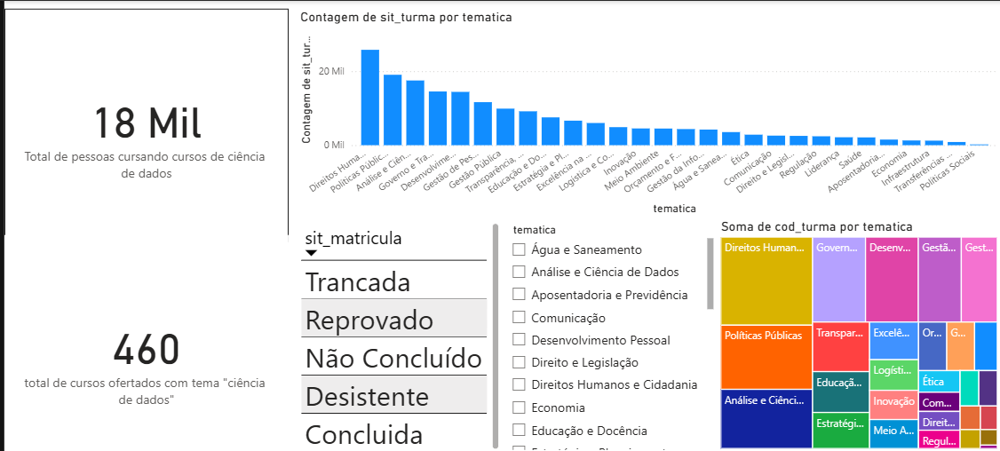
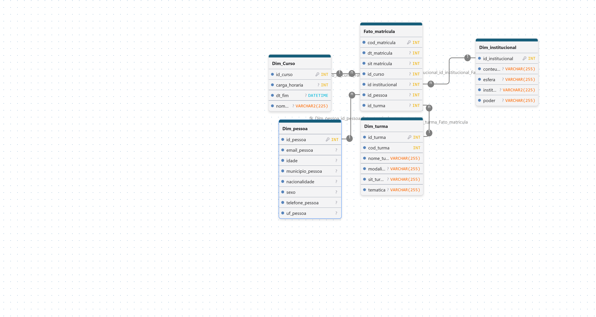

# Análise de Dados – Escola Virtual de Governo (EVG)

## Sobre o Projeto

Este repositório contém o desenvolvimento do projeto prático da disciplina Business Intelligence II, cujo objetivo é construir um modelo de dados avançado no formato Star Schema a partir de uma tabela desnormalizada (One Big Table) com dados públicos de matrículas e cursos da Escola Virtual de Governo (EVG).

A análise tem como tema central Cursos de Ciência de Dados, e busca responder às seguintes perguntas de negócio:

- Quantas pessoas estão cursando cursos de Ciência de Dados na EVG?
- Quantos cursos de Ciência de Dados são ofertados?

## Etapas Realizadas

### 1. Preparação e Versionamento

- Criação de um repositório local com Git.
- Criação de um novo projeto no Power BI no formato `.pbi` (Power BI Project).
- Armazenamento do dataset de amostra no diretório `data/`.
- Configuração do arquivo `.gitignore` para ignorar arquivos `.csv` e o diretório/arquivo `.abf`.
- Publicação do repositório no GitHub de forma pública.

### 2. Carga Inicial e Exploração

- Importação da planilha fornecida para o Power BI.
- Análise das colunas disponíveis no Power Query para compreender a granularidade dos dados.

### 3. Modelagem Lógica

- Utilização da ferramenta online DrawDB para desenhar o modelo lógico.
- Identificação das Tabelas Dimensão (ex.: Alunos, Cursos, Turmas) e da Tabela Fato (Matrículas).

### 4. Documentação do Modelo

- Exportação das imagens do modelo desenhado no DrawDB.
- Inclusão das imagens no arquivo `README.md` do repositório.

### 5. Implementação da Modelagem Física (Dimensão Curso)

- Criação/aplicação da modelagem física no Power BI/Power Query.
- Separação da tabela fato das dimensões.
- Criação de chaves substitutas para as dimensões, quando necessário.

### 6. Mesclagem e Vínculo de Chaves

- Mesclagem da `Fato_Matriculas` com cada uma das dimensões utilizando as chaves.

### 7. Limpeza da Tabela Fato

- Remoção das chaves naturais (atributos não otimizados) da tabela fato.
- Manutenção estrita das chaves das dimensões e dos dados do fato/evento.

### 8. Tipos de Dados e Carga

- Verificação e ajuste dos tipos de dados de todas as tabelas conforme boas práticas (evitando o tipo "Qualquer", formatando IDs numéricos corretamente etc.).
- Carga dos dados para o modelo.

### 9. Relacionamentos no Power BI

- Criação/verificação dos relacionamentos do tipo Um para Muitos (1:N) entre as chaves das dimensões e da tabela fato.
- Garantia da direção correta do filtro: das dimensões para a fato.

### 10. Visualização e Medidas

- Criação de uma visualização com os dados modelados.
- Definição das perguntas de negócio pelo aluno.
- Criação de duas medidas principais:
  - Total de Pessoas Cursando Cursos de Ciência de Dados
  - Total de Cursos Ofertados com o Tema Ciência de Dados

### 11. Entrega Final

- Commit das alterações no projeto local.
- Push das atualizações para o GitHub.
- README.md preenchido com as perguntas e as imagens do DrawDB.

## Dashboard

Espaço reservado para o print do dashboard final.



## Modelo Lógico (DrawDB)


## Medidas Criadas

### Total de Pessoas Cursando Cursos de Ciência de Dados

```dax
[Total de pessoas cursando cursos de ciência de dados =
CALCULATE(COUNTROWS('Dim_Turma'),
'Dim_Turma'[tematica]="Análise e Ciência de Dados")
```

### Total de Cursos Ofertados com o Tema Ciência de Dados

```dax
[total de cursos ofertados com tema "ciência de dados" = CALCULATE(DISTINCTCOUNT('
Dim_Turma'[cod_turma]),'Dim_Turma'[tematica]
="Análise e Ciência de Dados")]
```

## Estrutura do Repositório

```text
fotos/
   └── [fotos utilizadas no readme]
data/
 └── [dados_brutos]
projeto_evg.pbip
desktop.ini
README.md
.gitignore
```

## Links Úteis

- [DrawDB – Ferramenta de Modelagem](https://drawdb.vercel.app/)
- [Escola Virtual de Governo (EVG)](https://www.escolavirtual.gov.br/)
- [Power BI](https://powerbi.microsoft.com/)

## Autor

Eduardo Alves de Oliveira


[Meu Linkedin(https://www.linkedin.com/in/eduardo-alves-dados)]
